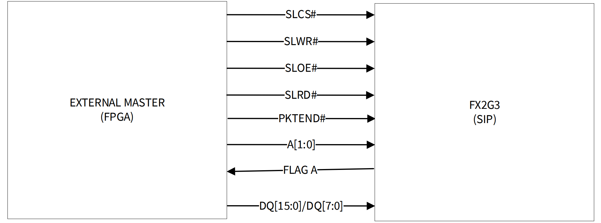

# EZ-USB&trade; FX2G3: LVCMOS Slave FIFO OUT application

This code example explains the configuration and usage of Sensor Interface Port (SIP) on the **EZ-USB&trade; FX2G3** device to implement the Synchronous Slave FIFO OUT protocol.
A master device that implements the Infineon-defined Synchronous Slave FIFO protocol is required to perform data transfers with this application.

> **Note:** This code example is an alpha release only for EZ-USB&trade; FX2G3 devices.

[View this README on GitHub.](https://github.com/Infineon/mtb-example-fx2g3-slave-fifo-out)

[Provide feedback on this code example.](https://cypress.co1.qualtrics.com/jfe/form/SV_1NTns53sK2yiljn?Q_EED=eyJVbmlxdWUgRG9jIElkIjoiQ0UyNDA2ODUiLCJTcGVjIE51bWJlciI6IjAwMi00MDY4NSIsIkRvYyBUaXRsZSI6IkVaLVVTQiZ0cmFkZTsgRlgyRzM6IExWQ01PUyBTbGF2ZSBGSUZPIE9VVCBhcHBsaWNhdGlvbiIsInJpZCI6InN1a3UiLCJEb2MgdmVyc2lvbiI6IjEuMC4yIiwiRG9jIExhbmd1YWdlIjoiRW5nbGlzaCIsIkRvYyBEaXZpc2lvbiI6Ik1DRCIsIkRvYyBCVSI6IldJUkVEIiwiRG9jIEZhbWlseSI6IkhTTFNfVVNCIn0=)


## Requirements


- [ModusToolbox&trade;](https://www.infineon.com/modustoolbox) v3.4 or later (tested with v3.4)
- Board support package (BSP) minimum required version: 4.3.3
- Programming language: C
- Associated parts: [EZ-USB&trade; FX2G3](https://www.infineon.com/cms/en/product/promopages/ez-usb-fx2g3/)


## Supported toolchains (make variable 'TOOLCHAIN')

- GNU Arm&reg; Embedded Compiler v11.3.1 (`GCC_ARM`) – Default value of `TOOLCHAIN`
- Arm&reg; Compiler v6.22 (`ARM`)


## Supported kits (make variable 'TARGET')

- [EZ-USB&trade; FX2G3 DVK](https://www.infineon.com/cms/en/product/promopages/ez-usb-fx2g3/) (`KIT_FX2G3_104LGA`) – Default value of `TARGET`


## Hardware setup

This example uses the board's default configuration. See the kit user guide to ensure that the board is configured correctly.


## Software setup

See the [ModusToolbox&trade; tools package installation guide](https://www.infineon.com/ModusToolboxInstallguide) for information about installing and configuring the tools package.

Install a terminal emulator if you don't have one. Instructions in this document use [Tera Term](https://teratermproject.github.io/index-en.html).

Install the **EZ-USB&trade; FX Control Center** (Alpha) application from the [Infineon Developer Center](https://softwaretools.infineon.com/tools/com.ifx.tb.tool.ezusbfxcontrolcenter).

This example requires no additional software or tools.


## Using the code example


### Create the project

The ModusToolbox&trade; tools package provides the Project Creator as both a GUI tool and a command line tool.

<details><summary><b>Use Project Creator GUI</b></summary>

1. Open the Project Creator GUI tool

   There are several ways to do this, including launching it from the dashboard or from inside the Eclipse IDE. For more details, see the [Project Creator user guide](https://www.infineon.com/ModusToolboxProjectCreator) (locally available at *{ModusToolbox&trade; install directory}/tools_{version}/project-creator/docs/project-creator.pdf*)

2. On the **Choose Board Support Package (BSP)** page, select a kit supported by this code example. See [Supported kits](#supported-kits-make-variable-target)

   > **Note:** To use this code example for a kit not listed here, you may need to update the source files. If the kit does not have the required resources, the application may not work

3. On the **Select Application** page:

   a. Select the **Applications(s) Root Path** and the **Target IDE**

   > **Note:** Depending on how you open the Project Creator tool, these fields may be pre-selected for you

   b. Select this code example from the list by enabling its check box

   > **Note:** You can narrow the list of displayed examples by typing in the filter box

   c. (Optional) Change the suggested **New Application Name** and **New BSP Name**

   d. Click **Create** to complete the application creation process

</details>


<details><summary><b>Use Project Creator CLI</b></summary>

The 'project-creator-cli' tool can be used to create applications from a CLI terminal or from within batch files or shell scripts. This tool is available in the *{ModusToolbox&trade; install directory}/tools_{version}/project-creator/* directory.

Use a CLI terminal to invoke the 'project-creator-cli' tool. On Windows, use the command-line 'modus-shell' program provided in the ModusToolbox&trade; installation instead of a standard Windows command-line application. This shell provides access to all ModusToolbox&trade; tools. You can access it by typing "modus-shell" in the search box in the Windows menu. In Linux and macOS, you can use any terminal application.

The following example clones the "[EZ-USB&trade; FX2G3: LVCMOS Slave FIFO OUT application](https://github.com/Infineon/mtb-example-fx2g3-slave-fifo-out)" application with the desired name "FX2G3 flash loader" configured for the *KIT_FX2G3_104LGA* BSP into the specified working directory, *C:/mtb_projects*:

   ```
   project-creator-cli --board-id KIT_FX2G3_104LGA --app-id mtb-example-fx2g3-slave-fifo-out --user-app-name FX2G3_LVCMOS_Slave_FIFO_OUT --target-dir "C:/mtb_projects"
   ```


The 'project-creator-cli' tool has the following arguments:


Argument | Description | Required/optional
---------|-------------|-----------
`--board-id` | Defined in the <id> field of the [BSP](https://github.com/Infineon?q=bsp-manifest&type=&language=&sort=) manifest | Required
`--app-id`   | Defined in the <id> field of the [CE](https://github.com/Infineon?q=ce-manifest&type=&language=&sort=) manifest | Required
`--target-dir`| Specify the directory in which the application is to be created if you prefer not to use the default current working directory | Optional
`--user-app-name`| Specify the name of the application if you prefer to have a name other than the example's default name | Optional
<br>

> **Note:** The project-creator-cli tool uses the `git clone` and `make getlibs` commands to fetch the repository and import the required libraries. For details, see the "Project creator tools" section of the [ModusToolbox&trade; tools package user guide](https://www.infineon.com/ModusToolboxUserGuide) (locally available at {ModusToolbox&trade; install directory}/docs_{version}/mtb_user_guide.pdf).

</details>


### Open the project

After the project has been created, you can open it in your preferred development environment.


<details><summary><b>Eclipse IDE</b></summary>

If you opened the Project Creator tool from the included Eclipse IDE, the project will open in Eclipse automatically.

For more details, see the [Eclipse IDE for ModusToolbox&trade; user guide](https://www.infineon.com/MTBEclipseIDEUserGuide) (locally available at *{ModusToolbox&trade; install directory}/docs_{version}/mt_ide_user_guide.pdf*).

</details>


<details><summary><b>Visual Studio (VS) Code</b></summary>

Launch VS Code manually, and then open the generated *{project-name}.code-workspace* file located in the project directory.

For more details, see the [Visual Studio Code for ModusToolbox&trade; user guide](https://www.infineon.com/MTBVSCodeUserGuide) (locally available at *{ModusToolbox&trade; install directory}/docs_{version}/mt_vscode_user_guide.pdf*).

</details>


<details><summary><b>Command line</b></summary>

If you prefer to use the CLI, open the appropriate terminal, and navigate to the project directory. On Windows, use the command-line 'modus-shell' program; on Linux and macOS, you can use any terminal application. From there, you can run various `make` commands.

For more details, see the [ModusToolbox&trade; tools package user guide](https://www.infineon.com/ModusToolboxUserGuide) (locally available at *{ModusToolbox&trade; install directory}/docs_{version}/mtb_user_guide.pdf*).

</details>


## Operation

1. Connect the board (J2) to your PC using the provided USB cable. Connect the USBFS port (J7) on the board to PC for debug logs

2. Open a terminal program and select the Serial COM port. Set the serial port parameters to 8N1 and 921600 baud

3. Perform the following steps to program the board using the [**EZ-USB&trade; FX Control Center**](https://softwaretools.infineon.com/tools/com.ifx.tb.tool.ezusbfxcontrolcenter) (Alpha) application

   1. To enter into Bootloader mode:

      a. Press and hold the **PMODE** (**SW1**) switch<br>
      b. Press and release the **RESET** switch<br>
      c. Finally, release the **PMODE** switch<br>

   2. Open **EZ-USB&trade; FX Control Center** application. <br> **EZ-USB&trade; FX2G3** device displays as **EZ-USB&trade; FX Bootloader**

   3. Navigate to **Program** > **Internal Flash**

   4. Navigate to the */build/APP_KIT_FX2G3_104LGA/Release/* folder within the CE directory and locate the *.hex* file and program

   5. Select the **FX2G3 Flash** loader device in the **EZ-USB&trade; FX Control Center**

   6. Navigate to **Program** > **External Flash**

   7. Browse the FPGA binary file in **\<CE Title>/BitFile** folder based on the configuration

   8. Once the FPGA binary programming is successful, return to the USB bootloader mode <br> Once the firmware binary has been programmed onto the FX2G3 device flash, the bootloader will keep transferring control to the application on every subsequent reset

   9. To return the control to USB bootloader, press **BOOT MODE/PMODE (SW1)** switch on *KIT_FX2G3_104LGA DVK* <br> While the device is reset or power cycled, the device will stay in the bootloader mode instead of booting into the application

   10. Select the **FX Bootloader** device in **EZ-USB&trade; FX Control Center** and navigate to **Program** > **Internal Flash**

   11. Navigate to the **/build/APP_KIT_FX2G3_104LGA/Release/** folder within the CE directory and locate the *.hex* file, and program <br> Confirm if the programming is successful in the log window of the FX Control Center application

4. After programming, the application starts automatically. Confirm that the title is displayed on the UART terminal as follows:

   **Figure 1. Terminal output on program startup**

   

   The device will enumerate as a WinUSB device.

5. When **WinUSB** device appears, open FX Control Center application, navigate to the **Performance Measurement** tab and initiate **BULK OUT Data** transfers on the selected endpoint


## Debugging

### Using the Arm&reg; debug port

You can debug the example to step through the code.


<details><summary><b>In Eclipse IDE</b></summary>

Use the **\<Application Name> Debug (KitProg3_MiniProg4)** configuration in the **Quick Panel**. For details, see the "Program and debug" section in the [Eclipse IDE for ModusToolbox&trade; user guide](https://www.infineon.com/MTBEclipseIDEUserGuide).


> **Note:** **(Only while debugging)** On the CM4 CPU, some code in `main()` may execute before the debugger halts at the beginning of `main()`. This means that some code executes twice – once before the debugger stops execution, and again after the debugger resets the program counter to the beginning of `main()`. See [KBA231071](https://community.infineon.com/docs/DOC-21143) to learn about this and for the workaround.

</details>


<details><summary><b>In other IDEs</b></summary>

Follow the instructions in your preferred IDE.
</details>

### Log messages

By default, the USBFS port is enabled for debug logs.

To enable debug logs on UART, set the `USBFS_LOGS_ENABLE` compiler flag to '0u' in the *Makefile*. SCB4 of the EZ-USB&trade; FX2G3 device is used as UART with a baud rate of 921,600 to send out log messages through the P11.0 pin.

The verbosity of the debug log output can be modified by setting the `DEBUG_LEVEL` macro in the *main.c* file shown in **Table 1**.

**Table 1. Debug values**

Macro value     |    Description
:-------------  | :------------
1u              | Enable error messages
2u              | Enable warning messages
3u              | Enable info messages
4u              | Enable all messages
<br>


## Design and implementation

> **Note:** The EZ-USB&trade; FX2G3 device has four MPNs/OPNs, each with distinct features. By default, this code example is compatible with the `CYUSB2318-BF104AXI` MPN, which is available on the `KIT_FX2G3_104LGA` kit. To use this code example with other MPNs, evaluate MPN compatibility and align it with the corresponding feature set. For details, contact the [Infineon support](https://www.infineon.com/cms/en/about-infineon/company/contacts/support/).


This code example demonstrates the implementation of a Synchronous Slave FIFO interface, where the Sensor Interface Port (SIP) on the EZ-USB&trade; FX2G3 device is connected to an FPGA/Master, enabling read access to the internal FIFO buffers of the EZ-USB&trade; FX2G3 device. This application uses various low-performance peripherals to interface with the system such as:

- I2C master to configure the data source/FPGA/master
- SMIF (in x4 or Quad mode) interface for downloading the FPGA configuration binary on every bootup

> **Note:** If REV02 Kit is used, FPGA is configured using SMIF in x4 or Quad mode else (for REV01) FPGA is configured using SMIF in x1 or Single mode.

- Enable debug prints over CDC using USBFS block on EZ-USB&trade; FX2G3 device


### Features of the application

- **USB specifications:** USB 2.0 (both Hi-Speed and Full-Speed)
- Supports read operation initiated by the FPGA/master device
- Supports read on both the GPIF threads, i.e., GPIF thread '0' and GPIF thread '1'


### Data streaming path

- The device enumerates as a vendor-specific USB device with two Bulk endpoints (1-OUT and 2-OUT)
- The application enables two Bulk, i.e., EP 1-OUT and EP 2-OUT with a maximum packet size of 512 bytes
- The device transmits the data through the following datapaths:

   - **Data Path#1:**  Data is received on EP 1-OUT and sent on LVCMOS Socket 0 (mapped to GPIF Thread 0)
   - **Data Path#2:**  Data is received on EP 2-OUT and sent on LVCMOS socket 1 (mapped to GPIF Thread 1)
- Four DMA buffers of 61440 (60KB) bytes size are used to hold the data while it is being forwarded to the USB


### Application workflow

The application flow involves three main steps: Initialization, USB device enumeration, and Slave FIFO OUT transfer.


#### Initialization

During initialization, the following steps are performed:
1. All the required data structures are initialized
2. USBD and USB driver (CAL) layers are initialized
3. Application registers all descriptors supported by function/application with the USBD layer
4. Application registers callback functions for different events like `RESET`, `SUSPEND`, `RESUME`, `SET_CONFIGURATION`, `SET_INTERFACE`, `SET_FEATURE`, and `CLEAR_FEATURE`. USBD will call the respective callback function when the corresponding events are detected
5. Initialize the data transfer state machines
6. Application registers handlers for all relevant interrupts
7. Application makes the USB device visible to the host by calling the Connect API
8. FPGA is configured using the SMIF (in x4 or quad mode) block to read the bit file stored in the external flash. FPGA sees the data on bus and gets configured
   > **Note:** If REV02 Kit is used, FPGA is configured using SMIF in x4 or Quad mode else (for REV01) FPGA is configured using SMIF in x1 or Single mode
9. FPGA is initialized using I2C writes to FPGA registers
10. Application initializes the SIP block on EZ-USB&trade; FX2G3 as required by the selected LVCMOS operating mode


#### USB device enumeration

1. During USB device enumeration, the host requests for descriptors, which are already registered with the USBD layer during the initialization phase
2. Host will send `SET_CONFIGURATION` command and `SET_INTERFACE` commands to activate the required function in the device
3. After the `SET_CONFIGURATION` and `SET_INTERFACE` commands, the application task takes control and enables the endpoints for data transfer


#### Slave FIFO OUT transfer

- Depending on the compile-time options, LVCMOS Interface, 16-bit bus width are selected
- Once the data transfers are initiated from the host application, FPGA/Master is configured to the stream data. DMA ready flag on the SIP interface asserts and the FPGA data sink starts reading the data from the FX2G3 device
- Data moves from the USB EP OUT to SRAM through high-bandwidth DMA to the LVCMOS subsystem
- The data is forwarded to the LVCMOS bus. DataWire DMA channels are used in the case of USBHS transfers

#### Slave FIFO interface
The Synchronous Slave FIFO interface connections are as follows:

**Table 2. Control signal usage in LVCMOS Slave FIFO state machine**

FX2G3 pin         | Function            | Description
:-------------    | :------------       | :--------------
P0CTL0            | SLCS#               | Active LOW Chip Select signal. Should be asserted (LOW) by the master/FPGA when communicating with FX2G3
P0CTL1            | SLWR#               | Active LOW Write Enable signal. Should be asserted (LOW) by the master/FPGA when sending any data to the FX2G3
P0CTL2            | SLOE#               | Active LOW Output Enable signal
P0CTL3            | SLRD#               | Active LOW Read Enable signal. Not used in this application as data is only being received by FX2G3
P0CTL4            | PKTEND#             | Active LOW Packet End signal. Should be asserted (LOW) when the FPGA/master wants to terminate the ongoing DMA transfer
P0CTL5            | FlagA               | Active LOW DMA ready indication for currently addressed/ active thread
P0D8              | A0                  | LS bit of 2-bit address bus used to select thread (applicable for 8-bit LVCMOS bus width)
P0D9              | A1                  | MS bit of 2-bit address bus used to select thread (applicable for 8-bit LVCMOS bus width)
P1CTL9            | A0                  | LS bit of 2-bit address bus used to select thread (applicable for 16-bit LVCMOS bus width)
P1CTL8            | A1                  | MS bit of 2-bit address bus used to select thread (applicable for 16-bit LVCMOS bus width)


**Figure 2. Control signal usage in LVCMOS receiver state machine**



> **Note:** Slave FIFO signals - SLCS#, SLRD#, SLOE#, FlagA, A0, A1 are applications for this code examples.


### Compile-time configurations

Application functionality can be customized by setting variables in *Makefile* or by configuring them through `make` CLI arguments.

- Run the `make build` command or build the project in your IDE to compile the application and generate a USB bootloader-compatible binary. This binary can be programmed onto the EZ-USB&trade; FX2G3 device using the EZ-USB&trade; Control Center application

- Run the `make build BLENABLE=no` command or set the variable in *Makefile* to compile the application and generate the standalone binary. This binary can be programmed onto the EZ-USB&trade; FX2G3 device through the SWD interface using the OpenOCD tool. For more details, see the [EZ-USB&trade; FX2G3 SDK user guide](./docs/EZ-USB-FX2G3-SDK-User-Guide.pdf)

- Run the `make build CORE=CM0P` command or set the variable in *Makefile* to compile and generate the binary for the Cortex&reg; M0+ core. By default, `CORE` is set as `CM4` and the binary is compiled and generated for the Cortex&reg; M4 core

- Choose between the **Arm&reg; Compiler** or the **GNU Arm&reg; Embedded Compiler** build toolchains by setting the `TOOLCHAIN` variable in *Makefile* to `ARM` or `GCC_ARM` respectively. If you set it to `ARM`, ensure to set `CY_ARM_COMPILER_DIR` as a make variable or environment variable, pointing to the path of the compiler's root directory

- Run the `make build REV02=no` command or set the variable in *Makefile* to compile the application and generate the binary compatible with the REV01 version of the EZ-USB&trade; FX2G3 kit
> **Note:** If REV02 Kit is used, FPGA is configured using SMIF in x4 or Quad mode else (for REV01) FPGA is configured using SMIF in x1 or Single mode.

By default, the application is configured to receive data from a 16-bit wide LVCMOS interface in SDR mode and make a USBHS data connection. Additional settings can be configured through macros specified by the `DEFINES` variable in *Makefile*:

**Table 2. Macro description**

 Macro name        |  Description                          | Allowed values
 :--------         | :-------------                        | :------------
 BUS_WIDTH_16      | Select the LVCMOS bus width           | 1u for 16-bit. <br> 0u for 8-bit bus width
 USBFS_LOGS_ENABLE | Enable debug logs through USBFS port  | 1u for debug logs over USBFS <br> 0u for debug logs over UART (SCB4)

<br>


## FPGA BitFile information

The FPGA binary in *BitFile* folder of the project can be programmed to an external flash on the FX2G3 DVK using the *mtb-example-fx2g3-flash-loader* firmware. 

Perform the following steps to program the binary file to the external flash.

1. Program *mtb-example-fx2g3-flash-loader.hex* using the **EZ-USB&trade; FX Control Center**
2. Navigate to **Program** > **External Flash** and browse the *FPGA binary* file
3. Check the programming status

**Table 3. BitFile description**

BitFile                                         |    Description   
:--------------------                           | :----------------                
*FX2G3_Design_PassiveX1_16Bit_LVCMOS_TX.bin*    | LVCMOS TX 16-bit for REV01 kit        
*FX2G3_Design_PassiveX1_8Bit_LVCMOS_TX.bin*     | LVCMOS TX 8-bit for REV01 kit
*FX2G3_Design_PassiveX4_16Bit_LVCMOS_TX.bin*    | LVCMOS TX 16-bit for REV02 kit (default)          
*FX2G3_Design_PassiveX4_8Bit_LVCMOS_TX.bin*     | LVCMOS TX 8-bit for REV02 kit
<br>

## FPGA configuration
FPGA configuration is done using the SMIF Block of FX2G3. SMIF (in x4 or Quad mode) interface is used for downloading the FPGA configuration binary on every bootup
Steps to configure FPGA (in Passive serialx4 mode)
- FX2G3 deasserts INT_RESET pin
- FX2G3 starts sending dummy SMIF (in x4 or quad mode) clock to read the fpga BitFile from SPI flash
- FPGA listens to the data on the SMIF lines and configures itself
- FPGA asserts CDONE# when configuration is complete

**Table 4. GPIOs for configuring FPGA on KIT_FX2G3_104LGA DVK**
FX2G3 Pin        | Function            | Description
:-------------   | :------------       | :--------------
GPIO5            | CDONE#              | Active HIGH signal. FPGA asserts when FPGA configuration is completed
GPIO6            | INT_RESET#          | Active LOW signal. FX device asserts to reset the FPGA
GPIO7            | PROG#               | Active LOW FPGA program signal


### Application files

**Table 4. Application file description**

File                                | Description   
:-------------                      | :------------                         
*gpif_header_lvcmos.h*              | Generated Header file for GPIF state configuration for LVCMOS interface
*usb_app.c*                         | C source file implementing slave FIFO OUT application
*usb_app.h*                         | Header file for application data structures and functions declaration
*usb_descriptors.c*                 | C source file containing the USB descriptors
*main.c*                            | Source file for device initialization, ISRs, LVCMOS interface initialization, etc
*usb_i2c.c*                         | C source file with I2C handlers
*usb_i2c.h*                         | Header file with I2C application constants and the function definitions
*usb_qspi.c*                        | C source file with SMIF handlers and FPGA configuration functions
*usb_qspi.h*                        | Header file with SMIF application constants and the function definitions
*cm0_code.c*                        | CM0 initialization code
*Makefile*                          | GNU make compliant build script for compiling this example

## Related resources

Resources  | Links
-----------|----------------------------------
User guide | [EZ-USB&trade; FX2G3 SDK user guide](./docs/EZ-USB-FX2G3-SDK-User-Guide.pdf)
Code examples  | [Using ModusToolbox&trade;](https://github.com/Infineon/Code-Examples-for-ModusToolbox-Software) on GitHub
Device documentation | [EZ-USB&trade; FX2G3 datasheets](https://www.infineon.com/cms/en/product/promopages/ez-usb-fx2g3/#!?fileId=8ac78c8c90530b3a01909c03f29537e0)
Development kits | Select your kits from the [Evaluation board finder](https://www.infineon.com/cms/en/design-support/finder-selection-tools/product-finder/evaluation-board).
Libraries on GitHub | [mtb-pdl-cat1](https://github.com/Infineon/mtb-pdl-cat1) – Peripheral Driver Library (PDL) and docs
Middleware on GitHub  | [usbfxstack](https://github.com/Infineon/usbfxstack) – USBFXStack middleware library and docs
Tools  | [ModusToolbox&trade;](https://www.infineon.com/modustoolbox) – ModusToolbox&trade; software is a collection of easy-to-use libraries and tools enabling rapid development with Infineon MCUs for applications ranging from wireless and cloud-connected systems, edge AI/ML, embedded sense and control, to wired USB connectivity using PSOC&trade; Industrial/IoT MCUs, AIROC&trade; Wi-Fi and Bluetooth&reg; connectivity devices, XMC&trade; Industrial MCUs, and EZ-USB&trade;/EZ-PD&trade; wired connectivity controllers. ModusToolbox&trade; incorporates a comprehensive set of BSPs, HAL, libraries, configuration tools, and provides support for industry-standard IDEs to fast-track your embedded application development.
<br>


## Other resources

Infineon provides a wealth of data at [www.infineon.com](https://www.infineon.com) to help you select the right device, and quickly and effectively integrate it into your design.


## Document history

Document title: *CE240685* – *EZ-USB&trade; FX2G3: LVCMOS slave FIFO OUT application*

 Version | Description of change
 ------- | ---------------------
 1.0.0   | New code example
 1.0.1   | Updated for REV02 Kit
 1.0.2   | Updated for CM0+
<br>


All referenced product or service names and trademarks are the property of their respective owners.

The Bluetooth&reg; word mark and logos are registered trademarks owned by Bluetooth SIG, Inc., and any use of such marks by Infineon is under license.


---------------------------------------------------------

© Cypress Semiconductor Corporation, 2025. This document is the property of Cypress Semiconductor Corporation, an Infineon Technologies company, and its affiliates ("Cypress").  This document, including any software or firmware included or referenced in this document ("Software"), is owned by Cypress under the intellectual property laws and treaties of the United States and other countries worldwide.  Cypress reserves all rights under such laws and treaties and does not, except as specifically stated in this paragraph, grant any license under its patents, copyrights, trademarks, or other intellectual property rights.  If the Software is not accompanied by a license agreement and you do not otherwise have a written agreement with Cypress governing the use of the Software, then Cypress hereby grants you a personal, non-exclusive, nontransferable license (without the right to sublicense) (1) under its copyright rights in the Software (a) for Software provided in source code form, to modify and reproduce the Software solely for use with Cypress hardware products, only internally within your organization, and (b) to distribute the Software in binary code form externally to end users (either directly or indirectly through resellers and distributors), solely for use on Cypress hardware product units, and (2) under those claims of Cypress's patents that are infringed by the Software (as provided by Cypress, unmodified) to make, use, distribute, and import the Software solely for use with Cypress hardware products.  Any other use, reproduction, modification, translation, or compilation of the Software is prohibited.
<br>
TO THE EXTENT PERMITTED BY APPLICABLE LAW, CYPRESS MAKES NO WARRANTY OF ANY KIND, EXPRESS OR IMPLIED, WITH REGARD TO THIS DOCUMENT OR ANY SOFTWARE OR ACCOMPANYING HARDWARE, INCLUDING, BUT NOT LIMITED TO, THE IMPLIED WARRANTIES OF MERCHANTABILITY AND FITNESS FOR A PARTICULAR PURPOSE.  No computing device can be absolutely secure.  Therefore, despite security measures implemented in Cypress hardware or software products, Cypress shall have no liability arising out of any security breach, such as unauthorized access to or use of a Cypress product. CYPRESS DOES NOT REPRESENT, WARRANT, OR GUARANTEE THAT CYPRESS PRODUCTS, OR SYSTEMS CREATED USING CYPRESS PRODUCTS, WILL BE FREE FROM CORRUPTION, ATTACK, VIRUSES, INTERFERENCE, HACKING, DATA LOSS OR THEFT, OR OTHER SECURITY INTRUSION (collectively, "Security Breach").  Cypress disclaims any liability relating to any Security Breach, and you shall and hereby do release Cypress from any claim, damage, or other liability arising from any Security Breach.  In addition, the products described in these materials may contain design defects or errors known as errata which may cause the product to deviate from published specifications. To the extent permitted by applicable law, Cypress reserves the right to make changes to this document without further notice. Cypress does not assume any liability arising out of the application or use of any product or circuit described in this document. Any information provided in this document, including any sample design information or programming code, is provided only for reference purposes.  It is the responsibility of the user of this document to properly design, program, and test the functionality and safety of any application made of this information and any resulting product.  "High-Risk Device" means any device or system whose failure could cause personal injury, death, or property damage.  Examples of High-Risk Devices are weapons, nuclear installations, surgical implants, and other medical devices.  "Critical Component" means any component of a High-Risk Device whose failure to perform can be reasonably expected to cause, directly or indirectly, the failure of the High-Risk Device, or to affect its safety or effectiveness.  Cypress is not liable, in whole or in part, and you shall and hereby do release Cypress from any claim, damage, or other liability arising from any use of a Cypress product as a Critical Component in a High-Risk Device. You shall indemnify and hold Cypress, including its affiliates, and its directors, officers, employees, agents, distributors, and assigns harmless from and against all claims, costs, damages, and expenses, arising out of any claim, including claims for product liability, personal injury or death, or property damage arising from any use of a Cypress product as a Critical Component in a High-Risk Device. Cypress products are not intended or authorized for use as a Critical Component in any High-Risk Device except to the limited extent that (i) Cypress's published data sheet for the product explicitly states Cypress has qualified the product for use in a specific High-Risk Device, or (ii) Cypress has given you advance written authorization to use the product as a Critical Component in the specific High-Risk Device and you have signed a separate indemnification agreement.
<br>
Cypress, the Cypress logo, and combinations thereof, ModusToolbox, PSoC, CAPSENSE, EZ-USB, F-RAM, and TRAVEO are trademarks or registered trademarks of Cypress or a subsidiary of Cypress in the United States or in other countries. For a more complete list of Cypress trademarks, visit www.infineon.com. Other names and brands may be claimed as property of their respective owners.
